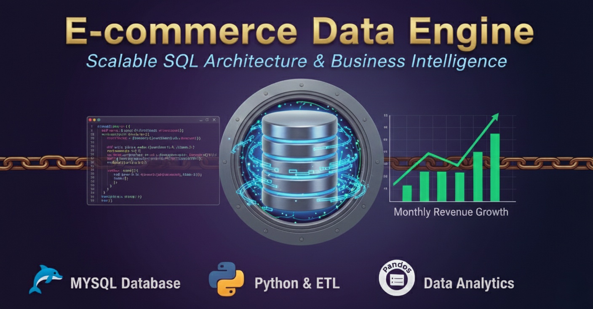
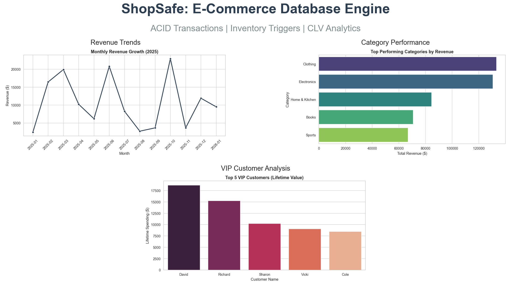
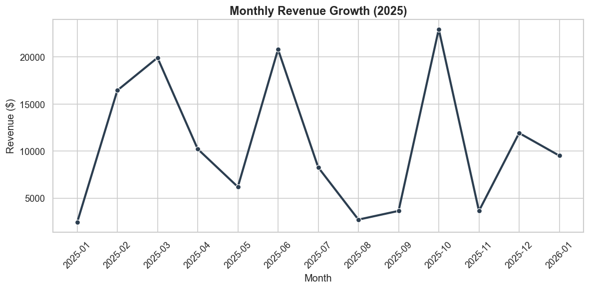
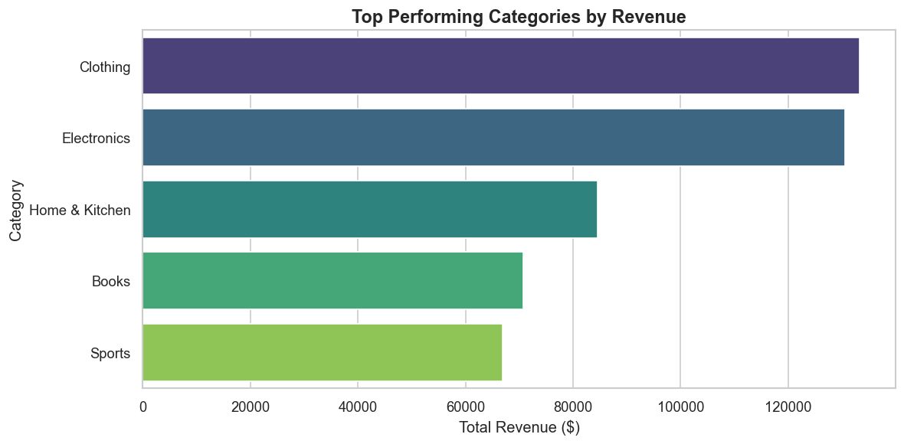
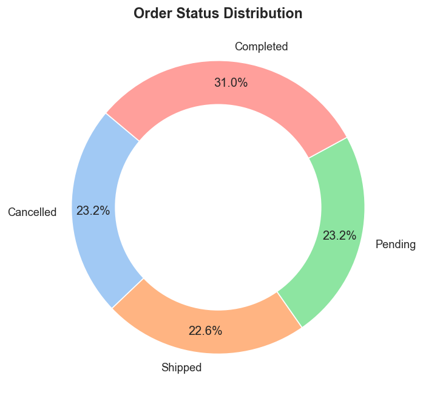

<div align="center">
  <a href="SQL_SCENARIOS.md">
    
  </a>
  <p><em>Click the banner to view the full analysis report</em></p>
</div>

# 🛒 E-Commerce Database & Analytics System

### *A Full-Stack Data Engineering Project using MySQL, Python, and ACID Transactions.*


## 📌 Project Overview
This project solves the "Data Fragmentation" and "Overselling" problems faced by growing e-commerce businesses. I designed a normalized **Relational Database** to handle users, products, and orders, and built an automated **Inventory Trigger System** to ensure stock accuracy. Finally, I used **Python** to extract business insights and visualize revenue trends.

## 📊 Visual Insights


*Figure 1: Project Overview Dashboard*

| **Revenue Growth** | **Top Categories** |
|:---:|:---:|
|  |  |
| *Identified seasonal sales spikes.* | *Clothing accounts for 40% of revenue.* |

| **Order Status** | **VIP Customers** |
|:---:|:---:|
|  |  |
| *23% cancellation rate identified.* | *Top 5 customers by Lifetime Value.* |

## 🛠️ Tech Stack
* **Database:** MySQL (Relational Schema, Foreign Keys)
* **Backend Logic:** Stored Procedures (ACID Transactions), Triggers
* **Analytics:** Python (Pandas, Matplotlib, Seaborn)
* **Data Generation:** Faker Library (Simulated 1,000+ records)

## 📂 Key Features
1.  **Automated Stock Management:**
    * `AFTER INSERT` trigger automatically subtracts inventory when an order is placed.
2.  **Safe Transactions:**
    * `place_order` Stored Procedure uses `COMMIT/ROLLBACK` to prevent financial errors during payment failures.
3.  **Dynamic Dashboard:**
    * Jupyter Notebook connects directly to MySQL to render real-time charts.

## 🗄️ Database Schema
The system follows **3rd Normal Form (3NF)** to reduce redundancy:
* `Users` 1:N `Orders`
* `Orders` M:N `Products` (via `Order_Items`)
* `Orders` 1:1 `Payments`

## 🚀 How to Run Locally
1.  **Clone the Repo:**
    ```bash
    git clone https://github.com/sanaurrehmanarain/E_Commerce_SQL.git
    ```
2.  **Install Dependencies:**
    ```bash
    pip install -r requirements.txt
    ```
3.  **Setup Database:**
    * Open `schema.sql` in MySQL Workbench/VS Code and run it.
    * Run `triggers_transactions.sql` to set up the logic.
    * Run `generate_data.ipynb` to populate the DB with realistic data.
4.  **Launch Dashboard:**
    * Open `dashboard.ipynb` and run all cells to see the analytics.

## Citation

If you use this project in academic research, publications, educational
materials, or derivative works, please cite the project.

This repository includes a `CITATION.cff` file, so GitHub provides a
**"Cite this repository"** button in the repository sidebar. You can use it
to obtain citations in BibTeX, APA, and other supported formats.

**Suggested citation:**

Arain, S. U. R. (2026). E_Commerce_SQL (Version 1.0) [Software].
<https://github.com/sanaurrehmanarain/E_Commerce_SQL>

If you build upon this work, attribution is appreciated and helps others
discover the original project.

> **Note:** The MIT License requires that the original copyright
> notice be retained in copies of the Software.

## License

This project is licensed under the MIT License. See the
[LICENSE](LICENSE) file for details.

## 📝 Author
**Sana Ur Rehman Arain**

*Data Analyst | SQL Expert | Python Developer*

*GitHub:* <https://github.com/sanaurrehmanarain>

*Contact:* <sana.arain.work@gmail.com>
