# ⚡ SQL Implementation & Business Analytics Scenarios

> **Project:** E-Commerce Database System  
> **Tech Stack:** MySQL, Python (Pandas/Matplotlib), ACID Transactions

This document showcases 22 distinct SQL challenges solved in this project, ranging from backend database triggers to high-level executive reporting.

---

## 🛠 Part 1: Database Engineering (Backend Logic)

### 1. Automated Stock Reduction (Trigger)

**Problem:** Preventing "overselling" (negative stock) when high-concurrency orders occur.

**Solution:** An `AFTER INSERT` trigger automatically decrements inventory when an order item is recorded.

```sql
CREATE TRIGGER after_order_item_insert
AFTER INSERT ON order_items
FOR EACH ROW
BEGIN
    UPDATE products
    SET stock_quantity = stock_quantity - NEW.quantity
    WHERE product_id = NEW.product_id;
END;
```

**Proof of Functionality:**

**Proof of Functionality:**

**Before purchase:**
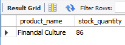

**After purchase:**
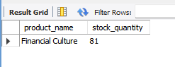

---

### 2. ACID Transaction (Stored Procedure)

**Problem:** If a payment fails after an order is created, the database is left in an inconsistent state (orphaned order).

**Solution:** A Stored Procedure with COMMIT and ROLLBACK logic.

```sql
CREATE PROCEDURE place_order(
    IN p_user_id INT,
    IN p_product_id INT,
    IN p_quantity INT,
    IN p_payment_method VARCHAR(50)
)
BEGIN
    DECLARE EXIT HANDLER FOR SQLEXCEPTION
    BEGIN
        ROLLBACK;
        SELECT 'Transaction Failed' AS status;
    END;
    
    START TRANSACTION;
        -- Insert Order
        -- Insert Order Items
        -- Process Payment
    COMMIT;
    SELECT 'Transaction Successful' AS status;
END;
```

---

## 📈 Part 2: Revenue & Financial Analytics

### 3. Monthly Revenue Growth (Time-Series)

**Business Value:** Identifies seasonal trends and financial health.

```sql
SELECT 
    DATE_FORMAT(order_date, '%Y-%m') AS month,
    COUNT(order_id) AS total_orders,
    SUM(total_amount) AS total_revenue
FROM orders
WHERE status = 'Completed'
GROUP BY month
ORDER BY month;
```

**Output:**

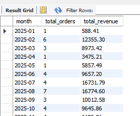

---

### 4. Top 3 Best-Selling Categories

**Business Value:** Informs inventory stocking decisions.

```sql
SELECT 
    c.category_name, 
    SUM(oi.quantity * oi.unit_price) AS category_revenue
FROM order_items oi
JOIN products p ON oi.product_id = p.product_id
JOIN categories c ON p.category_id = c.category_id
GROUP BY c.category_name
ORDER BY category_revenue DESC
LIMIT 3;
```

**Output:**

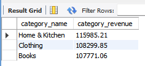

---

### 5. Average Order Value (AOV)

**Business Value:** A key metric for pricing strategy.

```sql
SELECT ROUND(AVG(total_amount), 2) AS avg_order_value
FROM orders
WHERE status = 'Completed';
```

**Output:**

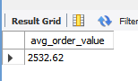

---

### 6. Daily Revenue Trend (Last 30 Days)

**Business Value:** Monitors short-term performance and campaign impact.

```sql
SELECT 
    DATE(order_date) AS date,
    SUM(total_amount) AS daily_revenue
FROM orders
WHERE order_date >= DATE_SUB(CURDATE(), INTERVAL 30 DAY)
AND status = 'Completed'
GROUP BY date
ORDER BY date;
```

**Output:**

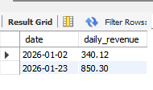

---

## 👥 Part 3: Customer Insights (Marketing)

### 7. VIP Customer Identification

**Business Value:** Target high-value users for loyalty programs.

```sql
SELECT 
    u.first_name, 
    u.last_name, 
    COUNT(o.order_id) AS total_orders, 
    SUM(o.total_amount) AS lifetime_value
FROM users u
JOIN orders o ON u.user_id = o.user_id
WHERE o.status = 'Completed'
GROUP BY u.user_id
ORDER BY lifetime_value DESC
LIMIT 5;
```

**Output:**

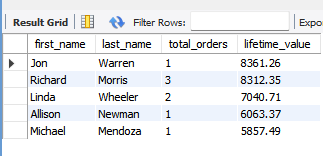

---

### 8. Churn Risk (No Purchases > 6 Months)

**Business Value:** Re-engagement campaigns for dormant users.

```sql
SELECT first_name, last_name, email
FROM users
WHERE user_id NOT IN (
    SELECT DISTINCT user_id 
    FROM orders 
    WHERE order_date >= DATE_SUB(CURDATE(), INTERVAL 6 MONTH)
);
```

**Output:**

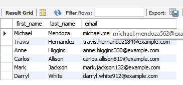

---

### 9. Customer Segmentation (Gold/Silver/Bronze)

**Business Value:** Categorizing users by spending tiers using CASE statements.

```sql
SELECT 
    customer_tier,
    COUNT(*) AS customer_count
FROM (
    SELECT 
        user_id,
        CASE 
            WHEN SUM(total_amount) > 1000 THEN 'Gold'
            WHEN SUM(total_amount) BETWEEN 500 AND 1000 THEN 'Silver'
            ELSE 'Bronze'
        END AS customer_tier
    FROM orders
    WHERE status = 'Completed'
    GROUP BY user_id
) AS subquery
GROUP BY customer_tier;
```

**Output:**

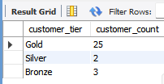

---

## 📦 Part 4: Inventory & Operations

### 10. Low Stock Alert

**Business Value:** Supply chain management warning system.

```sql
SELECT product_name, stock_quantity 
FROM products 
WHERE stock_quantity < 20 
ORDER BY stock_quantity ASC;
```

**Output:**

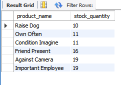

---

### 11. "Dead Stock" Analysis

**Business Value:** Identifying products that have never been sold to liquidate inventory.

```sql
SELECT product_name 
FROM products 
WHERE product_id NOT IN (
    SELECT DISTINCT product_id FROM order_items
);
```

**Output:**

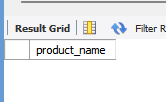

---

### 12. Most Popular Products (Volume)

**Business Value:** Identifies high-demand items regardless of price.

```sql
SELECT 
    p.product_name, 
    SUM(oi.quantity) AS total_sold
FROM order_items oi
JOIN products p ON oi.product_id = p.product_id
GROUP BY p.product_name
ORDER BY total_sold DESC
LIMIT 5;
```

**Output:**

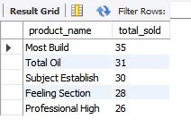

---

## 📊 Part 5: Advanced KPIs

### 13. Payment Method Preferences

**Business Value:** Optimizing payment gateway costs.

```sql
SELECT payment_method, COUNT(*) AS usage_count
FROM payments
WHERE status = 'Success'
GROUP BY payment_method;
```

**Output:**

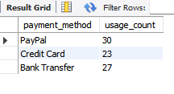

---

### 14. Monthly Revenue per User (ARPU)

**Business Value:** Measures revenue generation efficiency per customer.

```sql
SELECT 
    DATE_FORMAT(order_date, '%Y-%m') AS month,
    SUM(total_amount) / COUNT(DISTINCT user_id) AS arpu
FROM orders
WHERE status = 'Completed'
GROUP BY month;
```

**Output:**

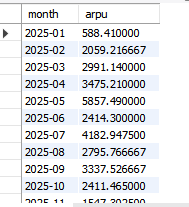

---

### 15. Peak Shopping Hours

**Business Value:** Optimizing server scaling and support staff shifts.

```sql
SELECT HOUR(order_date) AS hour_of_day, COUNT(order_id) AS order_count
FROM orders
GROUP BY hour_of_day
ORDER BY order_count DESC;
```

**Output:**

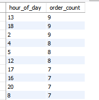

---

### 16. Order Status Distribution

**Business Value:** Monitoring logistics efficiency.

```sql
SELECT status, COUNT(*) AS count
FROM orders
GROUP BY status;
```

**Output:**

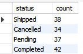

---

### 17. The "Whale" Orders

**Business Value:** Filtering for orders significantly above average.

```sql
SELECT order_id, total_amount 
FROM orders 
WHERE total_amount > (SELECT AVG(total_amount) FROM orders)
ORDER BY total_amount DESC
LIMIT 10;
```

**Output:**

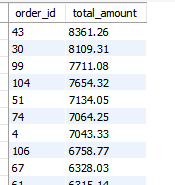

---

### 18. User Growth Rate

**Business Value:** Tracking new customer acquisition month-over-month.

```sql
SELECT DATE_FORMAT(created_at, '%Y-%m') AS month, COUNT(user_id) AS new_users
FROM users
GROUP BY month
ORDER BY month;
```

**Output:**

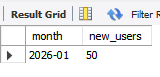

---

### 19. Total Inventory Asset Value

**Business Value:** Financial accounting of assets on hand.

```sql
SELECT SUM(price * stock_quantity) AS total_inventory_value 
FROM products;
```

**Output:**

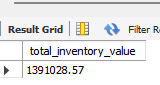

---

### 20. Most Expensive Products

**Business Value:** Identifying premium inventory.

```sql
SELECT product_name, price 
FROM products 
ORDER BY price DESC 
LIMIT 5;
```

**Output:**

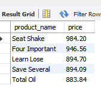

---

### 21. Repeat Customer Rate

**Business Value:** Measures brand loyalty.

```sql
SELECT user_id, COUNT(order_id) AS purchase_count
FROM orders
GROUP BY user_id
HAVING purchase_count > 1;
```

**Output:**

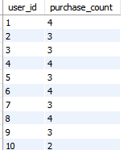

---

### 22. Average Basket Size

**Business Value:** Understanding customer purchasing behavior.

```sql
SELECT AVG(quantity) AS avg_items_per_order
FROM order_items;
```

**Output:**

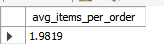

---